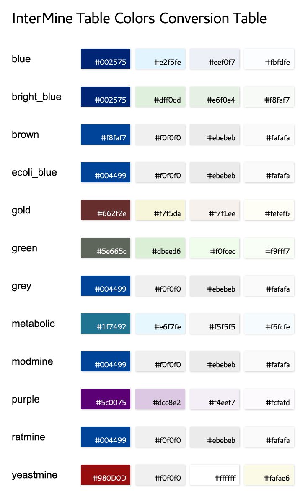
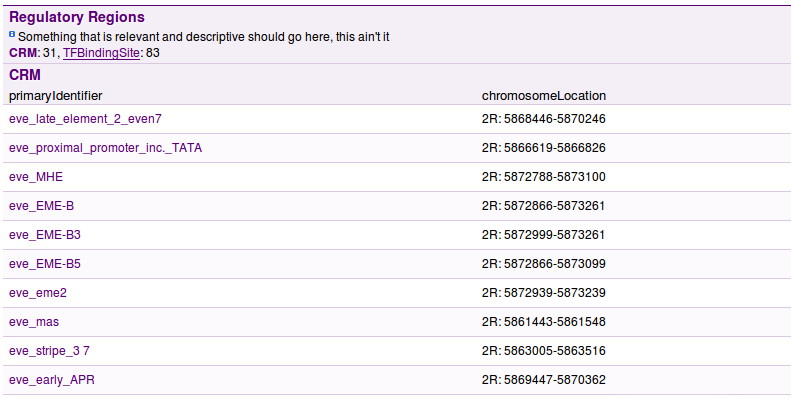

# webapp-tables

::: {.index} report page, webapp tables :::

## Webapp Tables CSS & HTML



### Inline List


```text
<div class="inline-list">
<h3>2 probeSets</h3>
<ul>
    <li>FBgn0014159, </li>
    <li><a>Complementation group F</a>, </li>
</ul>
</div>
```

CSS Description

`div.inline-list` wrapping the list and title in div makes it more clear what elements belong together and allow you to set a custom ID on the whole thing `div.inline-list h3` \(optional\) header 3 \(see below\) styling `div.inline-list ul` list we be displayed inline, without margins between items and without list styles \(circles, squares etc.\)

#### Inline List \(Inactive, No Results\)


```text
<div class="inline-list gray">
    <h3>0 probeSets</h3>
</div>
```

CSS Description

`div.inline-list.gray` one can apply an \'inactive\' theme by attaching a class to the top element

#### Inline List \(Tagging, Right\)


```text
<div class="inline-list">
    <h3><div class="right">Right positioned</div> 0 probeSets</h3>
</div>
```

CSS Description

`div.inline-list div.right` \(optional\) will float element to the right and apply appropriate colors to links; needs to go first, before any other text

#### \'Header\' Inline List


```text
<div class="inline-list">
    <ul>
        <li><span class="name">synonyms</span>:</li>
        <li>FBgn0014159, </li>
        <li>Complementation group F, </li>
        <li>FBgn0015483, </li>
    </ul>
</div>
```

CSS Description

`div.inline-list .name` \(optional\) the main theme color will be applied to the element

### Collection Table


```text
<div class="collection-table">
    <h3>1 protein</h3>
    <table>
        <thead>
            <tr><th>primaryIdentifier</th><th>primaryAccession</th></tr>
        </thead>
        <tbody>
            <tr>
                <td>EVE_DROME</td>
                <td>P06602</td>
                </tr>
                <tr>
                <td>AUTO_DROME</td>
                <td>P65</td>
            </tr>
        </tbody>
    </table>
</div>
```

CSS Description

`div.collection-table h3` table title will pickup theme colors much like Title \(Level 3\) below `div.collection-table thead th,td` table expects a thead element, that will apply the same background as the title `div.collection-table.nowrap` \(optional\) row columns do not wrap and are displayed inline

::: {.note} ::: {.title} Note :::

Modern browsers will apply alternating background and border on odd row columns, the rubbish \(IE\) will be fixed by running jQuery on page load. :::

#### Collection Table \(Type Column, Text Highlight\)


```text
<div class="collection-table">
    <h3>1 protein</h3>
    <table>
        <thead>
            <tr><th>primaryIdentifier</th><th>primaryAccession</th></tr>
        </thead>
        <tbody>
            <tr>
                <td class="class">EVE_DROME</td>
                <td>P06602</td>
                </tr>
                <tr>
                <td class="class">AUTO_DROME</td>
                <td>P65</td>
            </tr>
        </tbody>
    </table>
</div>
```

CSS Description `div.collection-table table td.class` applying a \'class\' class will highlight the text in the given column

#### Collection Table \(Vertical Column Border\)


```text
<div class="collection-table column-border">
    <-- ... -->
    <table>
        <-- ... -->
    </table>
</div>
```

CSS Description

`div.collection-table.column-border` uses a pseudoclass to apply a border between columns

::: {.note} ::: {.title} Note :::

Modern browsers will apply alternating background and border on odd row columns, the rubbish \(IE\) will be fixed by running jQuery on page load. :::

#### Collection Table \(Vertical Column Border by 2\)


```text
<div class="collection-table column-border-by-2">
    <-- ... -->
    <table>
        <-- ... -->
    </table>
</div>
```

CSS Description

`div.collection-table.column-border-by-2` uses a pseudoclass to apply a border between every other column

::: {.note} ::: {.title} Note :::

Modern browsers will apply alternating background and border on odd row columns, the rubbish \(IE\) will be fixed by running jQuery on page load. :::

#### Collection Table \(Inactive, No Results\)


```text
<div class="collection-table gray">
    <h3>0 genes</h3>
</div>
```

CSS Description

`div.collection-table.gray` one can apply an \'inactive\' theme by attaching a class to the top element

#### Collection Table \(Tagging, Right\)


```text
<div class="collection-table">
    <h3><div class="right">Right positioned</div> 0 genes</h3>
</div>
```

CSS Description

`div.collection-table div.right` \(optional\) will float element to the right and apply appropriate colors to links; needs to go first, before any other text

#### Collection Table \(Persistent Table Headers\)

```text
<div class="collection-table persistent">
    <-- ... -->
</div>
```

CSS Description

`div.collection-table.persistent` will make table headers persist as you scroll within the table

#### Basic Table \(Generic\)


```text
<div class="basic-table">
    <h3>Some title</h3>
    <table>
        <tr><td>Row column</td></tr>
    </table>
</div>
```

CSS Description

`div.basic-table h3` will apply the heading 3 style \(see below\) `div.basic-table div.right` \(optional\) will float element to the right and apply appropriate colors to links; needs to go first, before any other text `div.basic-table table` will make sure that the table is properly collapsed, has padding and does not have cellspacing `div.basic-table.gray` \(optional\) one can apply an \'inactive\' theme by attaching a class to the top element

#### Collection of Collection Tables



```text
<div class="collection-of-collections">
    <div class="header">
        <h3>Regulatory Regions</h3>
        <p>Description</p>
        <div class="switchers">
            <a class="active">CRM</a> <a>TFBindingSite</a>
        </div>
    </div>
    <div class="collection-table">
        <-- ... -->
    </div>
    <div class="collection-table">
        <-- ... -->
    </div>
</div>
```

CSS Description

`div.collection-of-collections` a div wrapper for collections `div.collection-of-collections div.header` will apply a background color that of collection table header `div.collection-of-collections div.header a.active` \(optional\) link elements are underlined by default and switched to bold if class \'active\' is applied to them

#### Table Togglers \(Less, More, Expand, Collapse, Show in table\)


```text
<div class="collection-table">
    <-- ... -->
    <div class="toggle">
        <a class="less">Show less</a>
        <a class="more">Show more</a>
    </div>
    <div class="show-in-table">
        <a href="#">Show all in a table</a>
    </div>
</div>
```

CSS Description

`div.collection-table div.toggle a.more` will create apply an expand/more button `div.collection-table div.toggle a.less` will create apply a collapse/less button; bear in mind that if you want to show it to the right like on report pages, it needs to go before other toggles and be floated right `div.collection-table div.toggle a` \(optional\) a generic button without any upward/downward arrows `div.collection-table div.show-in-table a` the appropriate color will be applied to the link contained, no more, no less \(in fact, show all\)

### Title \(Level 3\)


```text
<h3 class="goog">Link to other InterMines</h3>
```

CSS Description

`h3.goog` will pickup theme colors and apply Report Page/Google News -style colors, backgrounds, borders

### Smallfont, Display one-per-line


```text
<table class="tiny-font">
    <tr><td class="one-line">
        <a>One</a>
        <a>Two</a>
    </td></tr>
</table>
```

CSS Description

`.one-line *` applying class \'oneline\' will make _all descendants_ appear one per line `.tiny-font *` will apply 11px font size to _all descendants_

### Loading spinner \(AJAX\)

```text
<div class="loading-spinner"></div>
```

CSS Description

`.loading-spinner` will show an inline block positioned loading spinner gif

### Table Warning


```text
<div class="collection-table warning">
    <-- ... -->
</div>
```

CSS Description

`.warning` will show a warning icon and change the color of the div to pale yellow

